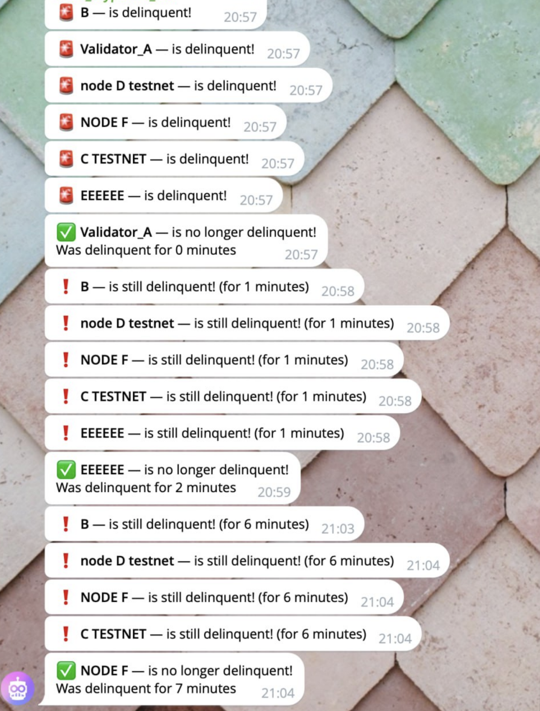

# 🚨 Solana Delinquency Alert Bot

This Bash script continuously monitors one or more Solana validators for **delinquency status** and sends real-time Telegram alerts when any validator goes delinquent.

It supports both mainnet and testnet, and can be run on a dedicated machine for audible or visible alerting.


---

## ⚙️ Features

- 🔍 Detects **delinquency events** instantly
- 📨 Sends immediate Telegram alerts
- 📡 Supports unlimited validators (mainnet & testnet)
- ⚙️ Runs as a background `systemd` service
- 🔄 Auto-restarts daily (e.g., via log rotation)

---

## 🧪 Configuration

You must **edit the script directly** to set your bot credentials and validators list.

### 🔐 Telegram Settings

Edit these two lines in the script:

```
bot_token="<BOT_TOKEN>"  
chat_id="<CHAT_ID>"
```

Use [@BotFather](https://t.me/BotFather) to get a bot token.  
You can get your chat ID using `/getUpdates` or [this method](https://stackoverflow.com/a/32572159).

---

### 🧩 Validator List

Define any number of validators by setting:

```
validators_clusters["IDENTITY1"]="-um"  
validators_names["IDENTITY1"]="Name_for_IDENTITY1"  
validators_enabled["IDENTITY1"]=1
```

You can mix mainnet (`-um`) and testnet (`-ut`) identities.  
Replace `IDENTITY1` with the actual public key.

---

## 🛠️ Setup

### 1. Make script executable:

```
sudo chmod +x /root/alert_solana_bot.sh
```

### 2. Install requirements:

```
sudo apt update && sudo apt upgrade -y  
sudo apt install -y curl jq git  
sh -c "$(curl -sSfL https://release.solana.com/v2.2.16/install)"  
export PATH="/root/.local/share/solana/install/active_release/bin:$PATH"
```

---

### 3. Create a `systemd` service:

```
sudo nano /etc/systemd/system/solana_validator_monitor.service
```

Paste the following content:
```
[Unit]
Description=Solana Delinquency Monitor
After=network.target

[Service]
ExecStart=/root/alert_solana_bot.sh
Restart=always
User=root
StandardOutput=syslog
StandardError=syslog
SyslogIdentifier=solana_validator_monitor
Environment="PATH=/root/.local/share/solana/install/active_release/bin:/usr/local/sbin:/usr/local/bin:/usr/sbin:/usr/bin:/sbin:/bin"

[Install]
WantedBy=multi-user.target
```

---

### 4. (Optional) Enable log rotation:

```
sudo nano /etc/logrotate.d/solana_validator_monitor
```

Paste:
```
/var/log/syslog
{
rotate 7
daily
missingok
notifempty
delaycompress
compress
postrotate
/usr/bin/systemctl reload rsyslog >/dev/null 2>&1 || true
endscript
}
```

---

### 5. Start the bot:

```
sudo systemctl daemon-reload  
sudo systemctl enable solana_validator_monitor  
sudo systemctl start solana_validator_monitor  
sudo systemctl status solana_validator_monitor
```

---

## 📄 Notes

- The script can be run on any external device or server (including Raspberry Pi)  
- Designed for use with sound-based or visible alert systems (e.g., flashing light, speakers)  
- The service restarts every night at midnight — if a validator is delinquent, internal timers will reset

Example log viewing:

```
tail -f ~/solana_validator_monitor.log
```

---

## 🛡️ Disclaimer

This script is **strictly focused on detecting validator delinquency** using `solana validators` output.  
Use it at your own risk and ensure that your bot token and chat ID are protected.

---

## Solana Delinquency Alert Bot Usage Example with random validators:
  
